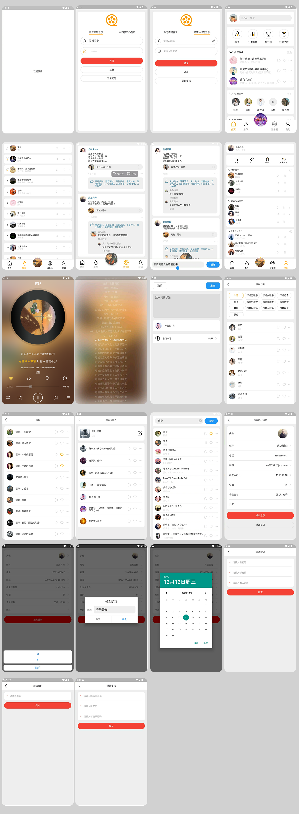
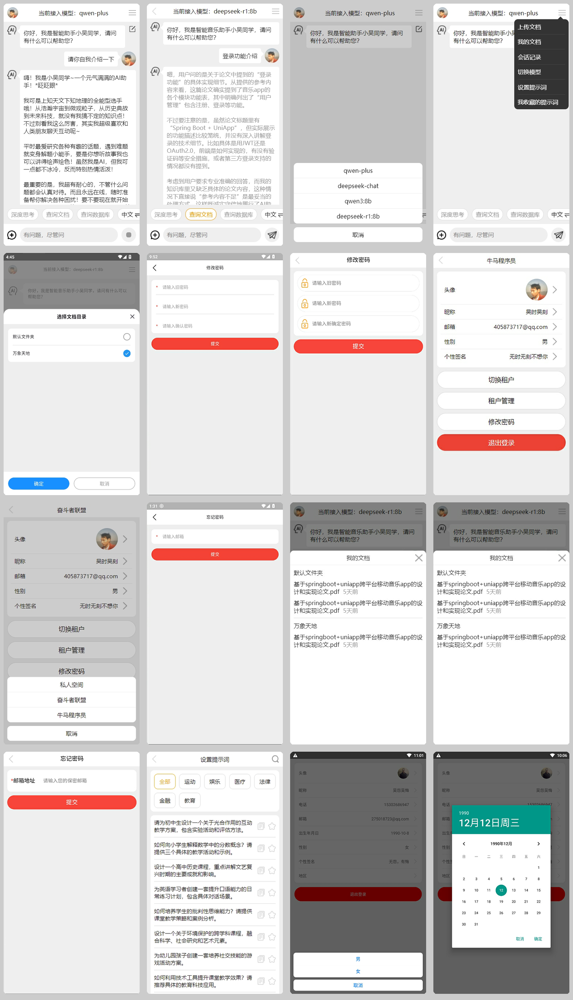
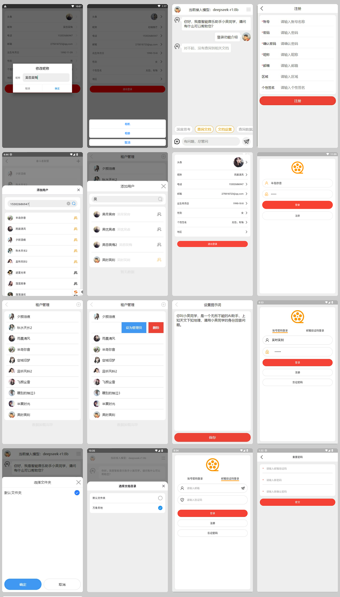

# springboot-app-service

由于密钥丢失，原地址 https://github.com/wuyuanwuhui99/springboot-app-service  将不在更新，迁移到新地址

有springboot2.0.1+jdk8升级到springboot3.4.5+jdk17

新增AI智能聊天模块和AI智能体，基于spring ai/langchain4j使用ollama调用本地deepseek-r1:8b/qwen3:8b大语言模型，支持模型切换，支持RAG文档查询和文档上传   

本地安装deepseek和千问大模型   
ollama pull deepseek-r1:8b   
ollama pull qwen3:8b  

本地安装向量数据库   
ollama pull mxbai-embed-large   
ollama pull nomic-embed-text   

使用springboot搭建的音乐，电影后台项目，所有数据来自互联网，使用python爬虫抓取，涉及，负载均衡，redis缓存，JwtToken权限验证，拦截器，日志记录，erauka服务治理，mybatis,spring-data-jpa,swagger等，持续更新中...   

================================APP界面预览================================   




================================APP界面预览================================   

================================sql实例===============================   


sql数据来自于python爬虫项目，自动爬取第三方电影网站，由于涉及到资源版权，爬虫项目暂未公开

如果打不开github地址，请用github的镜像地址，例如   
原地址：https://github.com/wuyuanwuhui999/springboot3-app-service   
镜像地址：https://bgithub.xyz/wuyuanwuhui999/springboot3-app-service   

后端接口项目和sql语句：   
github springboot2旧项目：https://github.com/wuyuanwuhui99/springboot-app-service （密钥丢失无法登录，该不在更新，迁移到wuyuanwuhui999账号下）   
github springboot3新项目：https://github.com/wuyuanwuhui999/springboot3-app-service   
github fast api版本：https://github.com/wuyuanwuhui999/fast-api-app-service   

gitee springboot2旧项目：https://gitee.com/wuyuanwuhui99/springboot-app-service   
gitee springboot3新项目：https://gitee.com/wuyuanwuhui99/springboot3-app-service   
gitee fast api版本：https://gitee.com/wuyuanwuhui99/fast-api-app-service   

uniapp ai智能体App项目参见   
github：https://github.com/wuyuanwuhui999/uniapp-vite-vue3-ts-chat-app-ui   
gitee：https://github.com/wuyuanwuhui99/uniapp-vite-vue3-ts-chat-app-ui   

jetpack compose ai智能体App项目参见   
github：https://github.com/wuyuanwuhui999/andriod-jetpack-compose-chat-app   
gitee：https://gitee.com/wuyuanwuhui99/andriod-jetpack-compose-chat-app   

swift ai智能体App项目参见   
github：https://github.com/wuyuanwuhui999/swift-chat-app   
gitee：https://gitee.com/wuyuanwuhui99/swift-chat-app   

flutter电影项目参见:   
github旧地址：https://github.com/wuyuanwuhui99/flutter-movie-app-ui   
github新地址：https://github.com/wuyuanwuhui999/flutter-movie-app-ui   
gitee地址：https://gitee.com/wuyuanwuhui99/flutter-movie-app-ui   

flutter音乐项目参见:   
github旧地址：https://github.com/wuyuanwuhui99/flutter-music-app-ui   
github新地址：https://github.com/wuyuanwuhui999/flutter-music-app-ui   
gitee地址：https://gitee.com/wuyuanwuhui99/flutter-music-app-ui   

react native电影参见:   
github地址：https://github.com/wuyuanwuhui99/react-native-app-ui   

java安卓原生电影参见：   
通用地址：https://github.com/wuyuanwuhui99/android-java-movie-app-ui   
gitee地址：https://gitee.com/wuyuanwuhui99/android-java-movie-app-ui   

uniapp电影参见：   
github旧地址：https://github.com/wuyuanwuhui99/uniapp-vite-vue3-ts-movie-app-ui   
github新地址：https://github.com/wuyuanwuhui999/uniapp-vite-vue3-ts-movie-app-ui   
gitee地址：https://gitee.com/wuyuanwuhui99/uniapp-vite-vue3-ts-movie-app-ui   

uniapp音乐项目参见：  
github旧地址：https://github.com/wuyuanwuhui99/uniapp-vite-vue3-ts-music-app-ui   
github新地址：https://github.com/wuyuanwuhui999/uniapp-vite-vue3-ts-music-app-ui   
gitee地址：https://gitee.com/wuyuanwuhui99/uniapp-vite-vue3-ts-music-app-ui   

微信小程序版本参见：
通用地址：https://github.com/wuyuanwuhui99/weixin-movie-app-ui.  
国内镜像地址：https://bgithub.xyz/wuyuanwuhui99/weixin-movie-app-ui.   

harmony鸿蒙电影参见:   
github旧地址：https://github.com/wuyuanwuhui99/Harmony_movie_app_ui.  
github新地址：https://github.com/wuyuanwuhui999/Harmony_movie_app_ui.  
gitee地址：https://gitee.com/wuyuanwuhui99/Harmony_movie_app_ui.   

harmony鸿蒙音乐项目参见:   
github旧地址：https://github.com/wuyuanwuhui99/harmony_music_app_ui.  
github新地址：https://github.com/wuyuanwuhui999/harmony_music_app_ui.  
gitee地址：https://gitee.com/wuyuanwuhui99/harmony_music_app_ui.   

vue在线音乐项目：   
通用地址：https://github.com/wuyuanwuhui99/vue-music-app-ui.   
国内镜像地址：https://bgithub.xyz/wuyuanwuhui99/vue-music-app-ui.   

在线音乐后端项目：
通用地址：https://github.com/wuyuanwuhui99/koa2-music-app-service    
国内镜像地址：https://bgithub.xyz/wuyuanwuhui99/koa2-music-app-service.   

vue3+ts明日头条项目：   
通用地址：https://github.com/wuyuanwuhui99/vue3-ts-toutiao-app-ui.  
国内镜像地址：https://bgithub.xyz/wuyuanwuhui99/vue3-ts-toutiao-app-ui。 

邮箱：275018723@qq.com.   

项目启动参数 -DSECRET=xxxxxxxxxxxxxxxxxxxxxxxxxx -DMYSQL_PASSWORD=wwq_2021 -DEMAIL=邮箱地址 -DEMAIL_PASSWORD=邮箱第三方授权码   
参数解析   
SECRET：密钥   
MYSQL_PASSWORD：数据库密码   
EMAIL：邮箱地址   
EMAIL_PASSWORD：邮箱授权码（不是登录QQ的密码）   

nacos common-config.yaml配置如下
```yaml
# MySQL配置
MYSQL_PASSWORD: your_mysql_password_123

# 邮箱配置
EMAIL: your_email@qq.com
EMAIL_PASSWORD: your_email_auth_code_123

# Token密钥
SECRET: xxxxxxxxxxxxxxxxxxxxxxxxxxxxxxxxx
```