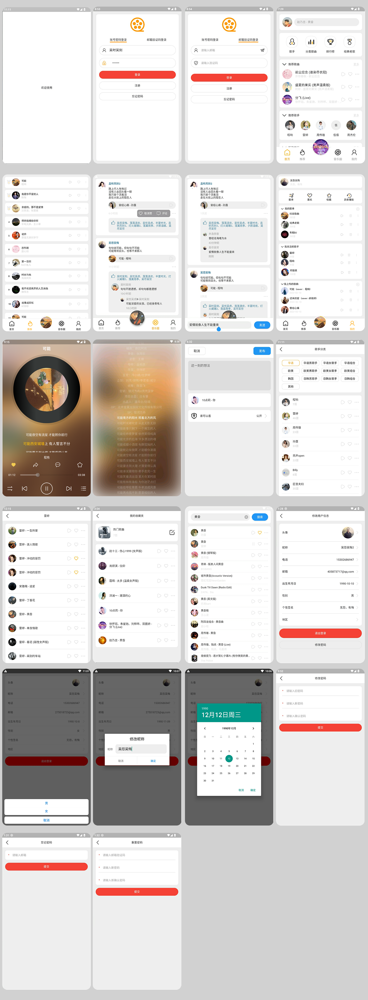
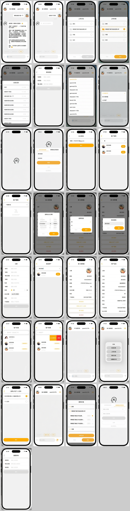

# springboot-app-service

由于密钥丢失，原地址 https://github.com/wuyuanwuhui99/springboot-app-service  将不在更新，迁移到新地址

有springboot2.0.1+jdk8升级到springboot3.4.5+jdk21

新增AI智能聊天模块和AI智能体，基于spring ai/langchain4j使用ollama调用本地deepseek-r1:8b/qwen3:8b大语言模型，支持模型切换，支持RAG文档查询和文档上传   

本地安装deepseek和千问大模型   
ollama pull deepseek-r1:8b   
ollama pull qwen3:8b  

本地安装向量数据库   
ollama pull nomic-embed-text   

使用springboot搭建的音乐，电影、智能体后台项目，所有数据来自互联网，使用python爬虫抓取，涉及，负载均衡，redis缓存，JwtToken权限验证，拦截器，日志记录，erauka服务治理，mybatis,spring-data-jpa,swagger等，持续更新中...   

================================电影、音乐、智能体APP界面预览================================   



================================APP界面预览================================   

================================sql实例===============================   


sql数据来自于python爬虫项目，自动爬取第三方电影网站，由于涉及到资源版权，爬虫项目暂未公开

邮箱：275018723@qq.com.   

项目启动参数 -DSECRET=xxxxxxxxxxxxxxxxxxxxxxxxxx -DMYSQL_PASSWORD=wwq_2021 -DEMAIL=邮箱地址 -DEMAIL_PASSWORD=邮箱第三方授权码   
参数解析   
SECRET：密钥   
MYSQL_PASSWORD：数据库密码   
EMAIL：邮箱地址   
EMAIL_PASSWORD：邮箱授权码（不是登录QQ的密码）   

nacos common-config.yaml配置如下
```yaml
# MySQL配置
MYSQL_PASSWORD: your_mysql_password_123

# 邮箱配置
EMAIL: your_email@qq.com
EMAIL_PASSWORD: your_email_auth_code_123

# Token密钥
SECRET: xxxxxxxxxxxxxxxxxxxxxxxxxxxxxxxxx
```