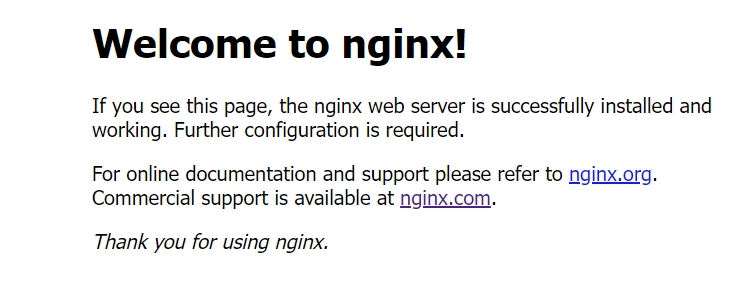

# springboot-app-service

由于密钥丢失，原地址 https://github.com/wuyuanwuhui99/springboot-app-service  将不在更新，迁移到新地址

有springboot2.0.1+jdk8升级到springboot3.4.5+jdk17

新增AI智能聊天模块和AI智能体，基于spring ai使用ollama调用本地deepseek-r1:7b大语言模型   

使用springboot搭建的音乐，电影后台项目，所有数据来自互联网，使用python爬虫抓取，涉及，负载均衡，redis缓存，JwtToken权限验证，拦截器，日志记录，erauka服务治理，mybatis,spring-data-jpa,swagger等，持续更新中...   

================================APP界面预览================================   


================================APP界面预览================================   

================================sql实例===============================   


sql数据来自于python爬虫项目，自动爬取第三方电影网站，由于涉及到资源版权，爬虫项目暂未公开

接口和数据请在本地电脑中，暂时没有购买和部署服务器，仅限本地调试，如有需要调试请联系本人启动外网映射

本地调试请把 http://192.168.0.5:5001 改成 http://254a2y1767.qicp.vip    
该地址是映射到本人电脑的地址，需要本人电脑开机才能访问，一般在工作日晚上八点半之后或者周末白天会开机   
如需了解是否已开机，请用浏览器直接打开该地址：http://254a2y1767.qicp.vip，如出现以下提示，则正常使用   


本站所有视频和图片均来自互联网收集而来，版权归原创者所有，本网站只提供web页面服务，并不提供资源存储，也不参与录制、上传 若本站收录的节目无意侵犯了贵司版权，请联系

联系方式：（微信）wuwenqiang_99、（邮箱）275018723@qq.com

================================sql实例===============================   


原地址 https://github.com/wuyuanwuhui99/springboot-app-service  将不在更新，迁移到新地址   
github新地址1：https://bgithub.xyz/wuyuanwuhui999/springboot-app-service (使用springboot2.0.1+jdk8)   
github新地址2：https://bgithub.xyz/wuyuanwuhui999/springboot3-app-service (使用springboot3.4.5+jdk17)
gitee新地址1：https://gitee.xyz/wuyuanwuhui99/springboot-app-service (使用springboot2.0.1+jdk8)   
gitee新地址2：https://gitee.com/wuyuanwuhui99/springboot3-app-service (使用springboot3.4.5+jdk17)

================================手机UI项目================================   
flutter版本参见:   
github旧地址：https://github.com/wuyuanwuhui99/flutter-movie-app-ui   
github新地址：https://github.com/wuyuanwuhui999/flutter-movie-app-ui   
gitee地址：https://hub.nuaa.cf/wuyuanwuhui99/flutter-movie-app-ui

flutter音乐项目参见:   
github地址：https://github.com/wuyuanwuhui99/flutter-music-app-ui   
github新地址：https://github.com/wuyuanwuhui999/flutter-music-app-ui    
gitee地址：https://hub.nuaa.cf/wuyuanwuhui99/flutter-music-app-ui

react native版本参见:   
github地址：https://github.com/wuyuanwuhui99/react-native-app-ui   

java安卓原生版本参见：  
通用地址：https://github.com/wuyuanwuhui99/android-java-movie-app-ui   
gitee地址：https://hub.nuaa.cf/wuyuanwuhui99/android-java-movie-app-ui

uniapp版本参见：
github地址：https://github.com/wuyuanwuhui99/uniapp-vite-vue3-ts-movie-app-ui   
github新地址：https://github.com/wuyuanwuhui999/uniapp-vite-vue3-ts-movie-app-ui 
gitee地址：https://gitee/wuyuanwuhui99/uniapp-vite-vue3-ts-movie-app-ui  

uniapp音乐项目参见：
github地址：https://github.com/wuyuanwuhui99/uniapp-vite-vue3-ts-music-app-ui   
github新地址：https://github.com/wuyuanwuhui999/uniapp-vite-vue3-ts-music-app-ui   
gitee地址：https://gitee/wuyuanwuhui99/uniapp-vite-vue3-ts-music-app-ui  

微信小程序版本参见：  
通用地址：https://github.com/wuyuanwuhui99/weixin-movie-app-ui、  
国内镜像地址：https://hub.nuaa.cf/wuyuanwuhui99/weixin-movie-app-ui

harmony鸿蒙版本参见:   
github地址：https://github.com/wuyuanwuhui99/Harmony_movie_app_ui   
github新地址：https://github.com/wuyuanwuhui999/harmony_movie_app_ui  
gitee地址：https://hub.nuaa.cf/wuyuanwuhui99/Harmony_movie_app_ui

harmony鸿蒙音乐项目参见:   
github地址：https://github.com/wuyuanwuhui99/harmony_music_app_ui   
github新地址：https://github.com/wuyuanwuhui999/harmony_music_app_ui    
gitee地址：https://hub.nuaa.cf/wuyuanwuhui99/harmony_music_app_ui

vue在线音乐项目：  
通用地址：https://github.com/wuyuanwuhui99/vue-music-app-ui   
国内镜像地址：https://hub.nuaa.cf/wuyuanwuhui99/vue-music-app-ui

在线音乐后端项目：  
通用地址：https://github.com/wuyuanwuhui99/koa2-music-app-service   
国内镜像地址：https://hub.nuaa.cf/wuyuanwuhui99/koa2-music-app-service

vue3+ts明日头条项目：  
通用地址：https://github.com/wuyuanwuhui99/vue3-ts-toutiao-app-ui  
国内镜像地址：https://hub.nuaa.cf/wuyuanwuhui99/vue3-ts-toutiao-app-ui   
================================手机UI项目================================   

项目启动参数 -DSECRET=WCdTBej2ZRhIBXafQbALbAwpJ5A+v1PR4A4IN6+OhnM= -DMYSQL_PASSWORD=wwq_2021 -DEMAIL=邮箱地址 -DEMAIL_PASSWORD=邮箱第三方授权码   
参数解析   
SECRET：密钥   
MYSQL_PASSWORD：数据库密码   
EMAIL：邮箱地址   
EMAIL_PASSWORD：邮箱授权码（不是登录QQ的密码）   

nginx(nginx.conf文件)配置如下   
```
server{
    listen       5001;
    location /service/movie/ {
        proxy_pass http://127.0.0.1:3001;
        client_max_body_size  1g;
    }
    location /service/music/ {
        proxy_pass http://127.0.0.1:3002;
        client_max_body_size  1g;
    }
    location /service/social/ {
        proxy_pass http://127.0.0.1:3003;
        client_max_body_size  1g;
    }
    location /service/circle/ {
        proxy_pass http://127.0.0.1:3004;
        client_max_body_size  1g;
    }
    location /service/user/ {
        proxy_pass http://127.0.0.1:3005;
        client_max_body_size  1g;
    }
    location /service/user-getway/ {
        proxy_pass http://127.0.0.1:3005;
        client_max_body_size  1g;
    }
     location /service/ai/ {
        proxy_pass http://127.0.0.1:3006;
        client_max_body_size  1g;
    }
    location /static/ {
        alias G:/static/;
    }
}
```

下面是一个使用 ChromaDB 的简单 Python 示例代码，使用python运行chroma，作为RAG向量数据库

```python
import chromadb

# 启动一个本地内存服务器（不持久化）
client = chromadb.Client()

# 创建一个集合（collection）
collection = client.create_collection("chroma_vector")

print("Chroma 已启动并创建了一个集合")